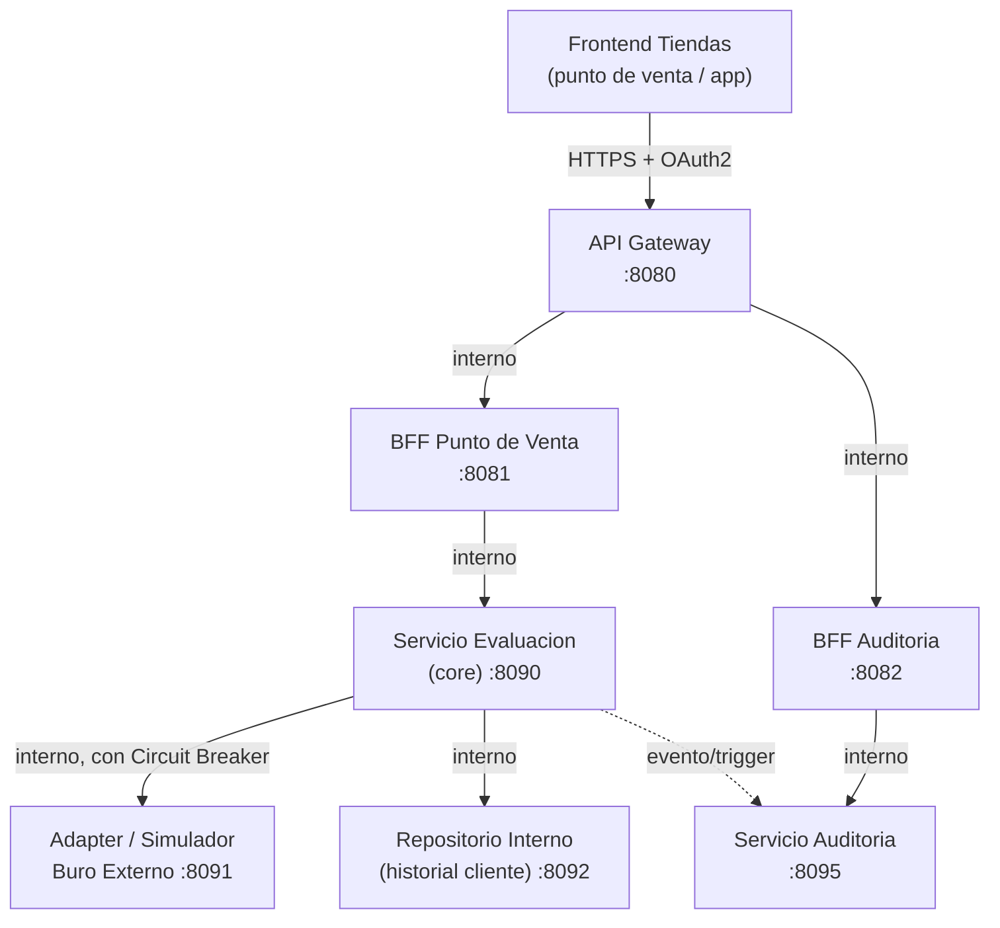

# Especificaciones OpenAPI por Componente — Resuelve

Sep 22, 2026 · @Someone

## Mapa de relaciones entre componentes

Cada componente tiene su **propio contrato OpenAPI independiente**, para que cada integrante lo implemente sin bloquear a los demás (contract-first: todos codifican contra el YAML acordado, no contra la implementación real de su vecino).



### Convención de base paths (para que los contratos no choquen)

| Componente | Base path sugerido | Consumido por |
| --- | --- | --- |
| API Gateway | `https://api.resuelve.com/v1` | Frontend Tiendas (público) |
| BFF Punto de Venta | `http://bff-pos.internal/v1` | API Gateway |
| BFF Auditoría | `http://bff-auditoria.internal/v1` | API Gateway |
| Servicio Evaluación (core) | `http://evaluacion.internal/v1` | BFF Punto de Venta |
| Adapter/Simulador Buró Externo | `http://buro-simulado.internal/v1` | Servicio Evaluación |
| Repositorio Interno | `http://repositorio-interno.internal/v1` | Servicio Evaluación |
| Servicio Auditoría | `http://auditoria.internal/v1` | Servicio Evaluación (escribe) y BFF Auditoría (lee) |

Cada spec de las secciones siguientes puede copiarse a su propio archivo `.yaml` (ej. `gateway.yaml`, `bff-pos.yaml`, etc.) dentro del repositorio del equipo, en una carpeta `contracts/` compartida.

## Spec 0: Contrato consumido por el Frontend Tiendas

Este es el contrato que le entregas al equipo de frontend para que avance **en paralelo**, sin esperar a que el backend esté listo: apunta al mismo path que Spec 1 (API Gateway) pero está redactado desde el punto de vista del consumidor, con campos exactamente iguales a los que ya usa el prototipo (identificación, monto, plazo, decisión, mensaje, si se consultó el buró, id de evaluación). El frontend construye contra este YAML con un mock (Prism, MSW, etc.) hasta que el Gateway real exista.

```yaml
openapi: 3.0.3
info:
  title: Contrato Frontend Tiendas - Resuelve
  version: "1.0.0"
  description: Contrato que consume el Frontend Tiendas (punto de venta). Mapea 1:1 al endpoint publico del API Gateway (Spec 1); util para mockear mientras el backend se construye.
servers:
  - url: https://api.resuelve.com/v1
paths:
  /evaluaciones-credito:
    post:
      summary: Envia la solicitud de credito capturada en el formulario
      operationId: crearEvaluacion
      security:
        - OAuth2: [evaluaciones:escribir]
      requestBody:
        required: true
        content:
          application/json:
            schema:
              $ref: '#/components/schemas/SolicitudFrontend'
            example:
              identificacion: "0102030405"
              montoSolicitado: 1200.00
              plazoMeses: 12
              tiendaId: "CENTRO-SUR-03"
      responses:
        '200':
          description: Decision emitida, lista para mostrar en pantalla
          content:
            application/json:
              schema:
                $ref: '#/components/schemas/DecisionFrontend'
              examples:
                aprobado:
                  summary: Escenario aprobado
                  value:
                    idEvaluacion: "7f2a91cd-aab1-4e2e-9c3a-111111111111"
                    decision: APROBADO
                    motivo: "Cumple reglas de score y capacidad de pago"
                    consultaBuroRealizada: false
                    fecha: "2026-09-22T21:04:00-05:00"
                revision:
                  summary: Escenario revision manual
                  value:
                    idEvaluacion: "7f2a91cd-aab1-4e2e-9c3a-222222222222"
                    decision: REVISION_MANUAL
                    motivo: "Score limitrofe, requiere validacion de un analista"
                    consultaBuroRealizada: true
                    fecha: "2026-09-22T21:04:00-05:00"
                rechazado:
                  summary: Escenario rechazado
                  value:
                    idEvaluacion: "7f2a91cd-aab1-4e2e-9c3a-333333333333"
                    decision: RECHAZADO
                    motivo: "Mora vigente en historial interno"
                    consultaBuroRealizada: true
                    fecha: "2026-09-22T21:04:00-05:00"
        '400':
          description: Datos del formulario invalidos (ej. identificacion vacia o monto negativo)
          content:
            application/json:
              schema:
                $ref: '#/components/schemas/Error'
        '401':
          description: Token invalido o ausente
        '429':
          description: Limite de tasa excedido, reintentar tras unos segundos
  /evaluaciones-credito/{id}:
    get:
      summary: Consulta el estado de una evaluacion previa (ej. al reabrir la pantalla de resultado)
      operationId: obtenerEvaluacion
      security:
        - OAuth2: [evaluaciones:leer]
      parameters:
        - name: id
          in: path
          required: true
          schema: { type: string, format: uuid }
      responses:
        '200':
          description: Decision almacenada
          content:
            application/json:
              schema:
                $ref: '#/components/schemas/DecisionFrontend'
        '404':
          description: Evaluacion no encontrada
components:
  securitySchemes:
    OAuth2:
      type: oauth2
      flows:
        clientCredentials:
          tokenUrl: https://auth.resuelve.com/oauth/token
          scopes:
            evaluaciones:escribir: Crear evaluaciones
            evaluaciones:leer: Consultar evaluaciones
  schemas:
    SolicitudFrontend:
      type: object
      required: [identificacion, montoSolicitado, plazoMeses]
      properties:
        identificacion:
          type: string
          description: Cedula o RUC capturado en el campo de texto del formulario
          example: "0102030405"
        montoSolicitado:
          type: number
          format: decimal
          minimum: 0
          example: 1200.00
        plazoMeses:
          type: integer
          enum: [6, 12, 18, 24]
          description: Debe coincidir con las opciones del selector de plazo en el formulario
        tiendaId:
          type: string
          description: Identificador de la tienda/caja que origina la solicitud (trazabilidad)
    DecisionFrontend:
      type: object
      properties:
        idEvaluacion:
          type: string
          format: uuid
          description: Se muestra en la pantalla de resultado como 'ID evaluacion'
        decision:
          type: string
          enum: [APROBADO, RECHAZADO, REVISION_MANUAL]
          description: Determina el icono, color y titulo de la pantalla de resultado
        motivo:
          type: string
          description: Texto que puede usarse como mensaje explicativo bajo el titulo
        consultaBuroRealizada:
          type: boolean
          description: Controla el texto de la fila 'Consulta a buro externo' en el resultado
        fecha:
          type: string
          format: date-time
    Error:
      type: object
      properties:
        codigo: { type: string, example: "IDENTIFICACION_INVALIDA" }
        mensaje: { type: string, example: "La identificacion ingresada no es valida" }
```

### Mapeo directo con las pantallas del prototipo

| Campo del contrato | Dónde aparece en el prototipo |
| --- | --- |
| `identificacion` (request) | Campo "Cédula / RUC" del formulario |
| `montoSolicitado` (request) | Campo "Monto solicitado" |
| `plazoMeses` (request) | Selector "Plazo" |
| `decision` (response) | Título, color e ícono de la pantalla de resultado (Aprobado/Revisión/Rechazado) |
| `motivo` (response) | Puede alimentar el subtítulo bajo el título de resultado |
| `consultaBuroRealizada` (response) | Fila "Consulta a buró externo" |
| `idEvaluacion` (response) | Fila "ID evaluación" |

Mientras el backend real no exista, el frontend puede correr un mock server directamente desde este YAML (`prism mock spec0.yaml`) y apuntar el prototipo ahí — así el equipo de frontend no queda bloqueado esperando a Spec 4 (core) ni a Spec 1 (Gateway).

## Spec 1: API Gateway (contrato público)

Es el único contrato que ve el **Frontend Tiendas**. Internamente el Gateway enruta hacia BFF Punto de Venta o BFF Auditoría según el path, valida el JWT y aplica rate limiting — pero eso no aparece en este YAML, porque es responsabilidad de infraestructura, no del contrato.

```yaml
openapi: 3.0.3
info:
  title: API Gateway - Resuelve
  version: "1.0.0"
  description: Punto único de entrada para tiendas y aliados externos. Enruta hacia BFF Punto de Venta y BFF Auditoria.
servers:
  - url: https://api.resuelve.com/v1
paths:
  /evaluaciones-credito:
    post:
      summary: Solicita una evaluacion de credito (enruta a BFF Punto de Venta)
      operationId: crearEvaluacion
      security:
        - OAuth2: [evaluaciones:escribir]
      requestBody:
        required: true
        content:
          application/json:
            schema:
              $ref: '#/components/schemas/SolicitudEvaluacion'
      responses:
        '200':
          description: Decision emitida
          content:
            application/json:
              schema:
                $ref: '#/components/schemas/Decision'
        '401':
          description: Token invalido o ausente
        '429':
          description: Limite de tasa excedido
  /evaluaciones-credito/{id}:
    get:
      summary: Consulta el estado de una evaluacion (enruta a BFF Punto de Venta)
      operationId: obtenerEvaluacion
      security:
        - OAuth2: [evaluaciones:leer]
      parameters:
        - name: id
          in: path
          required: true
          schema: { type: string, format: uuid }
      responses:
        '200':
          description: Estado actual
          content:
            application/json:
              schema:
                $ref: '#/components/schemas/Decision'
  /auditoria/evaluaciones:
    get:
      summary: Lista evaluaciones con filtros (enruta a BFF Auditoria, uso interno)
      operationId: listarAuditoria
      security:
        - OAuth2: [auditoria:leer]
      parameters:
        - name: estado
          in: query
          schema: { type: string, enum: [APROBADO, RECHAZADO, REVISION_MANUAL] }
        - name: fechaDesde
          in: query
          schema: { type: string, format: date }
        - name: fechaHasta
          in: query
          schema: { type: string, format: date }
        - name: page
          in: query
          schema: { type: integer, default: 0 }
        - name: size
          in: query
          schema: { type: integer, default: 20 }
      responses:
        '200':
          description: Pagina de resultados de auditoria
          content:
            application/json:
              schema:
                $ref: '#/components/schemas/PaginaAuditoria'
components:
  securitySchemes:
    OAuth2:
      type: oauth2
      flows:
        clientCredentials:
          tokenUrl: https://auth.resuelve.com/oauth/token
          scopes:
            evaluaciones:escribir: Crear evaluaciones
            evaluaciones:leer: Consultar evaluaciones
            auditoria:leer: Consultar auditoria interna
  schemas:
    SolicitudEvaluacion:
      type: object
      required: [identificacion, montoSolicitado, plazoMeses]
      properties:
        identificacion: { type: string, example: "0102030405" }
        montoSolicitado: { type: number, format: decimal }
        plazoMeses: { type: integer }
        referenciaPartner: { type: string }
    Decision:
      type: object
      properties:
        idEvaluacion: { type: string, format: uuid }
        decision: { type: string, enum: [APROBADO, RECHAZADO, REVISION_MANUAL] }
        motivo: { type: string }
        fecha: { type: string, format: date-time }
    PaginaAuditoria:
      type: object
      properties:
        total: { type: integer }
        page: { type: integer }
        items:
          type: array
          items:
            $ref: '#/components/schemas/Decision'
```

**Implementa:** rol Arquitecto/Tech Lead (coordina, ya que este contrato es la referencia de todos los demás).

## Spec 2: BFF Punto de Venta

Orientado a respuestas mínimas y rápidas para el flujo de venta en tienda: recibe la petición del Gateway, la traduce a lo que necesita el **Servicio de Evaluación (core)**, y devuelve solo lo que el cajero/app necesita mostrar.

```yaml
openapi: 3.0.3
info:
  title: BFF Punto de Venta - Resuelve
  version: "1.0.0"
  description: Backend for Frontend para el flujo de aprobacion de credito en tienda. Consume al Servicio de Evaluacion (core).
servers:
  - url: http://bff-pos.internal/v1
paths:
  /evaluaciones-credito:
    post:
      summary: Crea una evaluacion de credito para el punto de venta
      operationId: crearEvaluacionPos
      requestBody:
        required: true
        content:
          application/json:
            schema:
              $ref: '#/components/schemas/SolicitudEvaluacionPos'
      responses:
        '200':
          description: Resultado simplificado para mostrar en caja
          content:
            application/json:
              schema:
                $ref: '#/components/schemas/ResultadoPos'
  /evaluaciones-credito/{id}:
    get:
      summary: Consulta rapida de estado para mostrar en pantalla de caja
      operationId: obtenerEstadoPos
      parameters:
        - name: id
          in: path
          required: true
          schema: { type: string, format: uuid }
      responses:
        '200':
          description: Estado simplificado
          content:
            application/json:
              schema:
                $ref: '#/components/schemas/ResultadoPos'
components:
  schemas:
    SolicitudEvaluacionPos:
      type: object
      required: [identificacion, montoSolicitado, plazoMeses, tiendaId]
      properties:
        identificacion: { type: string }
        montoSolicitado: { type: number }
        plazoMeses: { type: integer }
        tiendaId:
          type: string
          description: Identifica la tienda que origina la venta (para trazabilidad)
    ResultadoPos:
      type: object
      description: Version reducida de la Decision del core, pensada para mostrarse en pantalla de caja en 1-2 lineas
      properties:
        idEvaluacion: { type: string, format: uuid }
        aprobado: { type: boolean }
        mensajeParaCliente:
          type: string
          description: Texto corto y humano, ej. "Credito aprobado" o "En revision, te contactaremos"
```

**Implementa:** Backend Dev — Seguridad e implementación (junto con el core, Spec 4, ya que están muy acoplados).

## Spec 3: BFF Auditoría

Orientado al analista interno que revisa el historial: respuestas ricas en datos, con paginación y filtros. Consume al **Servicio de Auditoría**, no al core directamente.

```yaml
openapi: 3.0.3
info:
  title: BFF Auditoria - Resuelve
  version: "1.0.0"
  description: Backend for Frontend para el panel interno de auditoria. Consume al Servicio de Auditoria.
servers:
  - url: http://bff-auditoria.internal/v1
paths:
  /evaluaciones:
    get:
      summary: Lista evaluaciones con filtros y paginacion, con el detalle completo para analistas
      operationId: listarEvaluacionesAuditoria
      parameters:
        - name: estado
          in: query
          schema: { type: string, enum: [APROBADO, RECHAZADO, REVISION_MANUAL] }
        - name: fechaDesde
          in: query
          schema: { type: string, format: date }
        - name: fechaHasta
          in: query
          schema: { type: string, format: date }
        - name: tiendaId
          in: query
          schema: { type: string }
        - name: page
          in: query
          schema: { type: integer, default: 0 }
        - name: size
          in: query
          schema: { type: integer, default: 20 }
      responses:
        '200':
          description: Pagina de evaluaciones con detalle completo
          content:
            application/json:
              schema:
                $ref: '#/components/schemas/PaginaDetalleAuditoria'
  /evaluaciones/{id}/detalle:
    get:
      summary: Detalle completo de una evaluacion, incluyendo si se consulto o no el buro externo
      operationId: obtenerDetalleAuditoria
      parameters:
        - name: id
          in: path
          required: true
          schema: { type: string, format: uuid }
      responses:
        '200':
          description: Detalle completo
          content:
            application/json:
              schema:
                $ref: '#/components/schemas/DetalleAuditoria'
components:
  schemas:
    DetalleAuditoria:
      type: object
      properties:
        idEvaluacion: { type: string, format: uuid }
        decision: { type: string, enum: [APROBADO, RECHAZADO, REVISION_MANUAL] }
        motivo: { type: string }
        fecha: { type: string, format: date-time }
        tiendaId: { type: string }
        consultaBuroRealizada:
          type: boolean
          description: Si fue necesario consultar el buro externo o se resolvio solo con reglas internas
        scoreBuro:
          type: integer
          nullable: true
        reglasAplicadas:
          type: array
          items: { type: string }
    PaginaDetalleAuditoria:
      type: object
      properties:
        total: { type: integer }
        page: { type: integer }
        items:
          type: array
          items:
            $ref: '#/components/schemas/DetalleAuditoria'
```

**Implementa:** QA/DevOps — Rendimiento y despliegue (es el contrato con menor riesgo de negocio, permite enfocarse en Fase 4 desde el inicio) o Product/Negocio, según disponibilidad.

## Spec 4: Servicio de Evaluación de Crédito (core)

El corazón del sistema: aplica el motor de reglas (Strategy + Chain of Responsibility), decide si consulta o no al buró externo, y dispara el registro de auditoría. Es el contrato más importante para sustentar los patrones de la Fase 2.

```yaml
openapi: 3.0.3
info:
  title: Servicio de Evaluacion de Credito (Core) - Resuelve
  version: "1.0.0"
  description: Motor de reglas de negocio. Orquesta Adapter Buro Externo, Repositorio Interno y dispara Servicio de Auditoria.
servers:
  - url: http://evaluacion.internal/v1
paths:
  /evaluar:
    post:
      summary: Ejecuta el motor de reglas sobre una solicitud de credito
      operationId: evaluarCredito
      requestBody:
        required: true
        content:
          application/json:
            schema:
              $ref: '#/components/schemas/SolicitudCore'
      responses:
        '200':
          description: Decision del motor de reglas
          content:
            application/json:
              schema:
                $ref: '#/components/schemas/DecisionCore'
  /evaluaciones/{id}:
    get:
      summary: Consulta el estado de una evaluacion previa
      operationId: obtenerEvaluacionCore
      parameters:
        - name: id
          in: path
          required: true
          schema: { type: string, format: uuid }
      responses:
        '200':
          description: Decision almacenada
          content:
            application/json:
              schema:
                $ref: '#/components/schemas/DecisionCore'
components:
  schemas:
    SolicitudCore:
      type: object
      required: [identificacion, montoSolicitado, plazoMeses]
      properties:
        identificacion: { type: string }
        montoSolicitado: { type: number }
        plazoMeses: { type: integer }
        tiendaId: { type: string }
    DecisionCore:
      type: object
      properties:
        idEvaluacion: { type: string, format: uuid }
        decision: { type: string, enum: [APROBADO, RECHAZADO, REVISION_MANUAL] }
        motivo: { type: string }
        fecha: { type: string, format: date-time }
        consultaBuroRealizada:
          type: boolean
          description: true si el motor tuvo que llamar al Adapter Buro Externo, false si se resolvio solo con Repositorio Interno
        reglasAplicadas:
          type: array
          items: { type: string }
          description: Nombres de las reglas (estrategias) que participaron en la decision, en orden
```

**Depende de (llama a):** Spec 5 (Adapter Buró Externo, con Circuit Breaker), Spec 6 (Repositorio Interno), y dispara un evento/llamada hacia Spec 7 (Servicio de Auditoría).

**Implementa:** Arquitecto/Tech Lead + Backend Dev — Seguridad e implementación (es el componente que más se sustenta en la defensa, conviene que lo construyan juntos).

## Spec 5: Adapter / Simulador de Buró Externo

Microservicio independiente que simula el comportamiento de un buró de crédito real, incluyendo la posibilidad de fallar o demorar a propósito para poder demostrar el Circuit Breaker en la Fase 4.

```yaml
openapi: 3.0.3
info:
  title: Simulador de Buro Externo - Resuelve
  version: "1.0.0"
  description: Simula un buro de credito real. Incluye modo de fallo/latencia controlada para pruebas de resiliencia.
servers:
  - url: http://buro-simulado.internal/v1
paths:
  /score/{identificacion}:
    get:
      summary: Consulta el score crediticio simulado de un cliente
      operationId: consultarScore
      parameters:
        - name: identificacion
          in: path
          required: true
          schema: { type: string }
      responses:
        '200':
          description: Score obtenido
          content:
            application/json:
              schema:
                $ref: '#/components/schemas/ScoreBuro'
        '503':
          description: Buro no disponible (modo de fallo simulado activo)
        '504':
          description: Timeout simulado
  /admin/escenario:
    post:
      summary: Configura el escenario simulado (uso interno para demos y pruebas de resiliencia)
      operationId: configurarEscenario
      requestBody:
        required: true
        content:
          application/json:
            schema:
              $ref: '#/components/schemas/EscenarioSimulado'
      responses:
        '204':
          description: Escenario aplicado
components:
  schemas:
    ScoreBuro:
      type: object
      properties:
        identificacion: { type: string }
        score:
          type: integer
          minimum: 300
          maximum: 850
        reportadoEnMora: { type: boolean }
    EscenarioSimulado:
      type: object
      properties:
        modo:
          type: string
          enum: [NORMAL, LATENCIA_ALTA, CAIDO]
        latenciaMs:
          type: integer
          description: Solo aplica si modo = LATENCIA_ALTA
```

**Implementa:** Backend Dev — Seguridad e implementación o QA/DevOps (es un buen componente para que lo tome quien vaya adelantado, es el más independiente de todos).

## Spec 6: Repositorio Interno (historial de cliente)

Expone el historial interno del cliente (compras y pagos previos con Resuelve) sin que el core necesite conocer el esquema de la base de datos — aplica el patrón Repository/Adapter.

```yaml
openapi: 3.0.3
info:
  title: Repositorio Interno de Clientes - Resuelve
  version: "1.0.0"
  description: Expone el historial interno de productos y pagos del cliente. Desacopla al core del esquema real de base de datos.
servers:
  - url: http://repositorio-interno.internal/v1
paths:
  /clientes/{identificacion}/historial:
    get:
      summary: Obtiene el historial interno de un cliente
      operationId: obtenerHistorialCliente
      parameters:
        - name: identificacion
          in: path
          required: true
          schema: { type: string }
      responses:
        '200':
          description: Historial encontrado
          content:
            application/json:
              schema:
                $ref: '#/components/schemas/HistorialCliente'
        '404':
          description: Cliente sin historial previo (cliente nuevo)
components:
  schemas:
    HistorialCliente:
      type: object
      properties:
        identificacion: { type: string }
        tieneMoraVigente: { type: boolean }
        creditosPrevios: { type: integer }
        ingresosDeclarados: { type: number, nullable: true }
        antiguedadMeses:
          type: integer
          description: Meses desde el primer registro del cliente en Resuelve
```

**Implementa:** Backend Dev — Seguridad e implementación (junto con el core; es el complemento directo del Adapter Buró Externo).

## Spec 7: Servicio de Auditoría

Recibe cada decisión desde el core (patrón Decorator/evento) y la almacena para trazabilidad. Es leído por el BFF Auditoría, nunca directamente por el Gateway.

```yaml
openapi: 3.0.3
info:
  title: Servicio de Auditoria - Resuelve
  version: "1.0.0"
  description: Registra y expone el historial de evaluaciones para trazabilidad y cumplimiento.
servers:
  - url: http://auditoria.internal/v1
paths:
  /registros:
    post:
      summary: Registra una nueva evaluacion (llamado por el core tras cada decision)
      operationId: registrarAuditoria
      requestBody:
        required: true
        content:
          application/json:
            schema:
              $ref: '#/components/schemas/RegistroAuditoria'
      responses:
        '201':
          description: Registro almacenado
    get:
      summary: Lista registros de auditoria con filtros (llamado por BFF Auditoria)
      operationId: listarRegistros
      parameters:
        - name: estado
          in: query
          schema: { type: string, enum: [APROBADO, RECHAZADO, REVISION_MANUAL] }
        - name: fechaDesde
          in: query
          schema: { type: string, format: date }
        - name: fechaHasta
          in: query
          schema: { type: string, format: date }
        - name: page
          in: query
          schema: { type: integer, default: 0 }
        - name: size
          in: query
          schema: { type: integer, default: 20 }
      responses:
        '200':
          description: Pagina de registros
          content:
            application/json:
              schema:
                $ref: '#/components/schemas/PaginaRegistros'
components:
  schemas:
    RegistroAuditoria:
      type: object
      required: [idEvaluacion, decision, fecha]
      properties:
        idEvaluacion: { type: string, format: uuid }
        decision: { type: string, enum: [APROBADO, RECHAZADO, REVISION_MANUAL] }
        motivo: { type: string }
        fecha: { type: string, format: date-time }
        tiendaId: { type: string }
        consultaBuroRealizada: { type: boolean }
        scoreBuro: { type: integer, nullable: true }
        reglasAplicadas:
          type: array
          items: { type: string }
    PaginaRegistros:
      type: object
      properties:
        total: { type: integer }
        page: { type: integer }
        items:
          type: array
          items:
            $ref: '#/components/schemas/RegistroAuditoria'
```

**Implementa:** QA/DevOps — Rendimiento y despliegue (junto con Spec 3, ya que ambos forman el flujo completo de auditoría).

## Reparto de trabajo

| Contrato | Componente | Sugerido para | Depende de (bloqueante) |
| --- | --- | --- | --- |
| Spec 1 | API Gateway | Arquitecto/Tech Lead | Ninguno — es la referencia, se hace primero |
| Spec 2 | BFF Punto de Venta | Backend Dev (con Spec 4) | Spec 4 (core) |
| Spec 3 | BFF Auditoría | QA/DevOps o Product/Negocio | Spec 7 (Auditoría) |
| Spec 4 | Servicio Evaluación (core) | Arquitecto + Backend Dev | Spec 5 y Spec 6 |
| Spec 5 | Adapter/Simulador Buró Externo | Backend Dev o QA/DevOps | Ninguno — puede empezar en paralelo desde el día 1 |
| Spec 6 | Repositorio Interno | Backend Dev (con Spec 4) | Ninguno — puede empezar en paralelo desde el día 1 |
| Spec 7 | Servicio Auditoría | QA/DevOps | Ninguno — puede empezar en paralelo desde el día 1 |

### Cómo trabajar en paralelo sin bloquearse

1. **Día 1:** todo el equipo revisa y aprueba los 7 YAML juntos (una sola sesión corta) — una vez acordados, nadie debería cambiar el contrato de otro sin avisar.
2. **Mientras se construye el core (Spec 4):** Spec 5, Spec 6 y Spec 7 se pueden implementar en paralelo desde cero, porque no dependen de nada más.
3. **Mocks para no bloquear:** cada quien puede generar un mock server desde su propio YAML (ej. con Prism: `prism mock spec5.yaml`) para que otros integrantes prueben contra su contrato **antes** de que la implementación real exista — así Spec 2 y Spec 3 pueden avanzar consumiendo mocks de Spec 4 y Spec 7 respectivamente, sin esperar a que esos servicios estén terminados.
4. **Integración real:** se reemplazan los mocks por las implementaciones reales a medida que cada quien termina, validando que ninguna respuesta se desvió de lo pactado en el YAML.

Esta separación de 7 contratos independientes es también la evidencia más directa para el criterio de la rúbrica sobre BFF, Gateway y desacoplamiento de contrato en la Fase 2/RA2.
